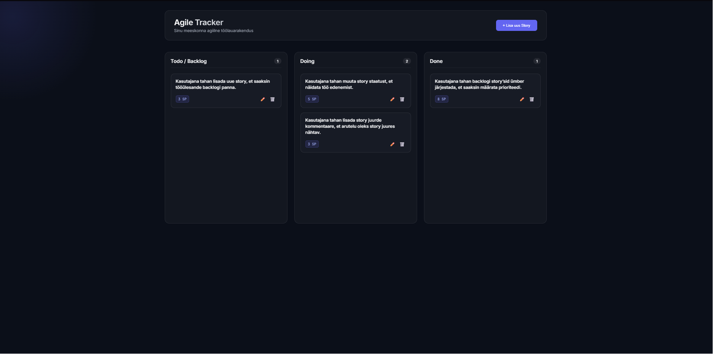

# Agile Tracker

Kanban-tahvel agiilse tarkvaraprojekti kasutajalugude (story'de) haldamiseks.



## 1. Mis tehnoloogiaid kasutasid?

- **Backend**: Node.js + Express.js
- **Frontend**: Vanilla JavaScript, HTML5, CSS3 (dark glassmorphism design)
- **Andmehaldus**: JSON-fail (data/stories.json)
- **Drag-and-drop**: HTML5 native Drag and Drop API
- **Fontid**: Google Fonts (Inter, JetBrains Mono)

## 2. Kuidas rakendus käivitada?

1. Veendu, et sul on Node.js installeeritud (versioon 18+ soovitatav)
2. Kloneeri repo ja liigu kausta:
   ```
   git clone <repo-url>
   cd sander-agile-tracker
   ```
3. Paigalda sõltuvused:
   ```
   npm install
   ```
4. Käivita rakendus:
   ```
   npm start
   ```
5. Ava brauseris: [http://localhost:3000](http://localhost:3000)

Esimene käivitus loob automaatselt data/stories.json faili näidisandmetega.

## 3. Millised funktsioonid valmis said?

- [x] Story'de kuvamine Kanban-laua kolmes veerus (Todo/Backlog, Doing, Done)
- [x] Story lisamine (title, description, points, acceptance criteria, mockup URL)
- [x] Story muutmine
- [x] Story kustutamine
- [x] Story staatuse muutmine drag-and-drop'iga veergude vahel
- [x] Backlogi järjestamine hiirega lohistades (järjekord säilib pärast refreshi)
- [x] Punktide määramine koos valideerimisega (mitte-negatiivne täisarv)
- [x] Vastuvõtutingimuste lisamine (mitu tingimust)
- [x] Kommentaaride lisamine koos ajatempliga
- [x] Kommentaaride muutmine ja kustutamine
- [x] Story detailvaade (kuvab kõik väljad, kommentaarid, vastuvõtutingimused)
- [x] Punktide summa iga veeru all
- [x] Loomise ja muutmise kuupäeva kuvamine
- [x] Mockup pildi link story küljes
- [x] REST API kõigi vajalike endpointidega

### REST API endpoint'id

| Meetod | Endpoint | Kirjeldus |
|--------|----------|-----------|
| GET | /api/stories | Kõik story'd järjestatuna |
| GET | /api/stories/:id | Üks story ID järgi |
| POST | /api/stories | Lisa uus story |
| PUT | /api/stories/:id | Muuda storyt |
| DELETE | /api/stories/:id | Kustuta story |
| PATCH | /api/stories/:id/status | Muuda staatust |
| PATCH | /api/stories/reorder | Muuda backlogi järjestust |
| POST | /api/stories/:id/comments | Lisa kommentaar |
| PUT | /api/stories/:storyId/comments/:commentId | Muuda kommentaari |
| DELETE | /api/stories/:storyId/comments/:commentId | Kustuta kommentaar |

## 4. Millised funktsioonid jäid pooleli?

- [ ] Otsing (search/filter)
- [ ] Filtreerimine staatuse või punktide järgi
- [ ] Automaattestid REST API jaoks

## 5. Millised olid kõige keerulisemad kohad?

- **Drag-and-drop kolme veeru vahel**: HTML5 native DnD API-ga tuli hallata nii staatuse muutmist kui ka backlogi järjestuse salvestamist korraga. Kõige keerulisem oli tagada, et järjestus säiliks pärast staatuse muutmist.
- **Mitme vastuvõtutingimuse dünaamiline lisamine vormis**: Vaja oli hoida UI ja andmestruktuur sünkroonis nii lisamisel kui muutmisel.
- **Glassmorphism kujundus**: Tumeda teema ja klaasiefektidega UI nõudis hoolikat CSS-i, et see näeks välja professionaalne ja oleks samas loetav.
